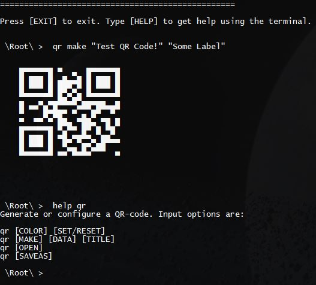

#  pyQR-CLI 

### Command-Line-Interface (CMD) based QR-Code Generator.
This custom CLI uses intuitive command arguments, and sub-string parsing.

 
Examples of available command arguments:

`qr [MAKE] [DATA] [TITLE]`
 `qr [COLOR] [SET/RESET]`
 `qr [SAVE]`
 `qr [SAVEAS]`

 

## Terminal Interface 

 

## Output QR Image 

